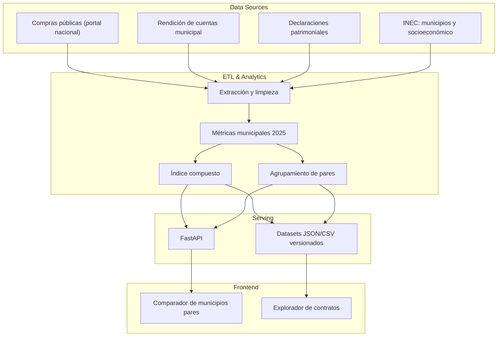

# Índice de Transparencia Municipal · Ecuador

> **Status:** `Production` · **Domain:** Public Governance / Civic Tech · **Last validated:** 2025 (datos anuales)

[](LICENSE)
[](https://python.org)
[](data/processed)
[](docs)

## 📌 Executive Summary

Plataforma ciudadana que construye un **Índice de Transparencia Municipal** para Ecuador y compara
cada municipio con sus **pares similares** (por tamaño, presupuesto e indicadores socioeconómicos),
exponiendo diferencias en compras públicas, cumplimiento de rendición de cuentas y declaraciones
patrimoniales. Con datos abiertos de 2025, permite a ciudadanía y periodistas detectar anomalías en
contratación pública y priorizar vigilancia con evidencia.

## 🎯 Business Impact & KPIs

| Business problem | KPI optimized | Baseline | Target | Observed |
|---|---|---|---|---|
| Transparencia municipal difícil de comparar y auditar | Cobertura de municipios con índice | Parcial | Todos (221) | **221 municipios (2025)** |
| Anomalías de contratación ocultas | Detección de concentración de proveedores | Sin herramienta | Automatizada | **Comparador de pares operativo** |
| Rendición de cuentas desigual | Diferencias visibles entre pares | Sin referencia | Comparación por pares | **Índice + peer groups publicados** |

**Por qué importa:** la transparencia no se mejora con denuncias aisladas sino con **evidencia
comparable**. El comparador de municipios pares convierte datos abiertos en presión social
informada y en insumo para periodismo de datos.

## 🧠 Methodology & Statistical Rigor

- **Hipótesis:** la transparencia municipal es un constructo latente medible a través de componentes
  observables: apertura de datos, calidad de compras públicas, rendición de cuentas y declaraciones
  patrimoniales.
- **Enfoque:** **índice compuesto** con componentes ponderados (Apertura de Datos 30% + compras +
  rendición + declaraciones), normalización robusta y **agrupamiento de municipios pares** por
  similitud (tamaño, presupuesto, indicadores socioeconómicos INEC) para comparaciones justas.
- **Supuestos:** los datos oficiales (portal de compras públicas, rendición, INEC) son comparables
  entre municipios; la ponderación refleja prioridades ciudadanas y se documenta explícitamente.
- **Tests de estabilidad:** análisis de sensibilidad de la ponderación (rangos de ranking estable),
  robustez de la normalización (min-max vs. percentiles) y validación cruzada del agrupamiento de
  pares.

### Ecuaciones clave

Índice compuesto para el municipio $i$:

$$I_i = \sum_{j=1}^{k} w_j\, x_{ij}^{\text{norm}}, \qquad \sum_j w_j = 1, \quad w_j \ge 0$$

Normalización min-max por componente:

$$x_{ij}^{\text{norm}} = \frac{x_{ij} - \min_j}{\max_j - \min_j} \in [0, 1]$$

## 🏗️ System Architecture



## 📊 Results

| Metric | Value | Detail |
|---|---|---|
| Cobertura | 221 municipios | Índice de transparencia 2025 |
| Componentes del índice | 4 ponderados | Apertura de datos 30% + compras, rendición, declaraciones |
| Comparación por pares | Automatizada | Agrupamiento por similitud (tamaño, presupuesto, socioeconómico) |
| Datos de contratos | JSON por municipio | `docs/data/contracts_*.json`, trazables a la fuente |
| Licencia de datos | Documentada | `data_license.md` |

## 🛠️ Tech Stack

| Layer | Tools |
|---|---|
| Orchestration / ETL | Python, scripts de extracción y limpieza, datasets JSON/CSV versionados |
| Modeling / Analytics | Índice compuesto, normalización, agrupamiento de pares (estadística descriptiva + clustering) |
| Deployment | FastAPI, frontend estático (CSS/JS), GitHub Pages para datasets públicos |

## 📂 Project Structure

```
.
├── data/
│   ├── raw/inec/           # Municipios INEC
│   └── processed/          # Métricas, índice y pares (CSV + JSON 2025)
├── docs/
│   ├── css/, data/         # Frontend y datasets de contratos por municipio
│   └── ...
├── data_license.md
└── tests/
```

## 🚀 Quick Start

```bash
git clone https://github.com/jordanvt18/transparency-index-ecuador
cd transparency-index-ecuador
python -m venv .venv && source .venv/bin/activate
pip install -r requirements.txt

# 1. Reconstruir métricas e índice (datos 2025 incluidos)
python scripts/build_index.py          # (ajusta el nombre real del script de tu pipeline)
# 2. Servir API
uvicorn src.api.main:app --reload
# 3. Explorar datasets y frontend en docs/
```

**Requisitos:** Python 3.10+, acceso a los portales de datos abiertos para re-extracción (los datos
2025 ya están versionados en `data/processed`).

## 📈 Monitoring & Governance

- **Actualización:** ciclo anual con los datos oficiales publicados; re-ejecución completa del ETL.
- **Calidad de datos:** validación de esquemas y cobertura por municipio antes de publicar el índice.
- **Reproducibilidad:** datasets versionados y metodología documentada; licencia de datos explícita.
- **Auditoría ciudadana:** trazabilidad de cada componente a su fuente; comparador de pares como control de sesgo por tamaño/presupuesto.
